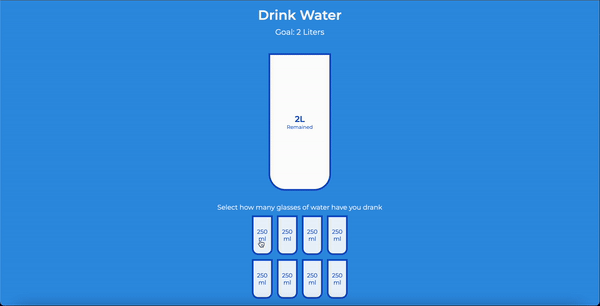

# Drink_Water
A web application that helps you track and remind yourself to drink water regularly.

## Preview

## Technologies Used

- HTML
- CSS
- JavaScript

## Features

- Set a daily water intake goal.
- Track your water consumption throughout the day.
- Receive timely reminders to drink water.
- Visual representation of your progress.
- Customizable settings for reminders and goal.

## Getting Started

To get a local copy of the project, you can follow these steps:

1. Clone the repository: git clone https://github.com/your-username/drink-water.git
2. Open the index.html file in your web browser.

## Usage
- Set your daily water intake goal in the application.
- Start tracking your water consumption by clicking on the "Add Water" button.
- Receive reminders at regular intervals to drink water.
- Visualize your progress with the progress bar and statistics.
- Adjust the application settings as needed.
- Feel free to customize the project according to your needs. You can modify the HTML, CSS, and JavaScript code to add additional features or change the design.

## License

This project is licensed under the [MIT License](LICENSE).

## Acknowledgement

The project is part of the "50 projects in 50 days - HTML, CSS & Javascript" course on Udemy by Brad Traversy.

